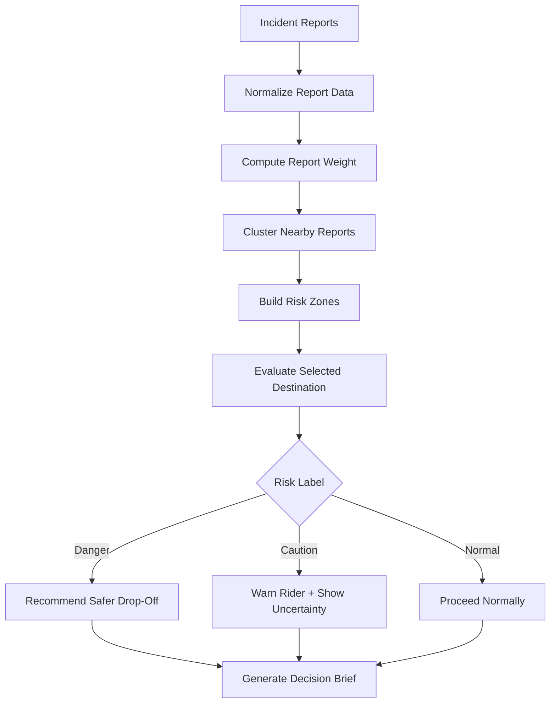
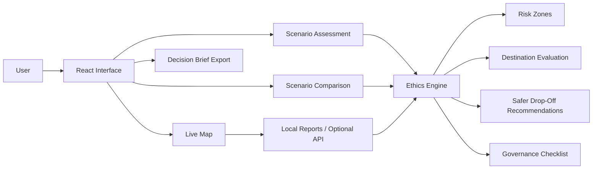

<div align="center">

# 🚕 Autonomous Taxi AI Ethics Map  
### Uncertainty-Aware Navigation for Responsible Robo-Cab Drop-Off Decisions

A modern interactive prototype that shows how an autonomous taxi system can make safer, more transparent, and more ethically accountable drop-off decisions when local conditions are uncertain.

Instead of treating a destination as automatically safe, the system evaluates nearby reports, detects uncertainty zones, explains its reasoning, and recommends safer nearby handoff points when needed.

<br />


<br />
<br />


</div>

---

## Table of Contents

- [Project Overview](#project-overview)
- [Core Idea](#core-idea)
- [Why This Matters](#why-this-matters)
- [Main Features](#main-features)
- [Demo Walkthrough](#demo-walkthrough)
- [Ethics-by-Design Framework](#ethics-by-design-framework)
- [How the Ethics Engine Works](#how-the-ethics-engine-works)
- [System Architecture](#system-architecture)
- [Tech Stack](#tech-stack)
- [Run Locally](#run-locally)
- [Environment Variables](#environment-variables)
- [Project Structure](#project-structure)
- [Example Use Cases](#example-use-cases)
- [Limitations](#limitations)
- [Future Improvements](#future-improvements)
- [Academic References](#academic-references)
- [Author](#author)

---

## Project Overview

**Autonomous Taxi AI Ethics Map** is a front-end AI ethics prototype for autonomous taxi navigation. It explores one central question:

> How should a Robo-Cab behave when the requested drop-off location is technically reachable, but the surrounding social or safety context is uncertain?

The prototype turns that ethical question into an interactive map-based system. A user can select pickup and drop-off points, inspect active risk reports, view danger-zone overlays, receive route-risk warnings, and see safer drop-off recommendations when the original destination has low confidence.

This project is not a production ride-hailing system. It is a responsible AI design prototype that demonstrates how ethics, uncertainty, explainability, stakeholder impact, and governance can be translated into interface behavior.

---

## Core Idea

Most navigation systems answer a simple question:

> “Can the vehicle reach the destination?”

This prototype asks a more responsible question:

> “Should the system treat this exact drop-off as normal, uncertain, or unsafe based on the available evidence?”

That shift matters because an autonomous taxi can be technically correct and still socially wrong. For example, the vehicle may be able to reach a curb, but that curb may currently be affected by crowd surges, poor lighting, police activity, harassment reports, road blockage, or conflicting community signals.

The prototype responds to uncertainty through four visible behaviors:

| Confidence State | Meaning | System Behavior |
|---|---|---|
| ⚪ White Confidence | No strong active alert nearby | Proceed normally, but do not claim guaranteed safety |
| 🟠 Orange Uncertainty | Some meaningful but incomplete evidence | Warn the rider and recommend caution |
| 🔴 Red Confidence | Low confidence in exact drop-off | Recommend a safer nearby handoff point |
| 🟣 Critical | Severe or clustered reports | Require stronger justification or human override |

---

## Why This Matters

Autonomous mobility is not only a routing problem. It is also a social, ethical, and governance problem.

A Robo-Cab makes decisions in public spaces, around pedestrians, riders, emergency responders, communities, and operators. If the system hides uncertainty or acts with false confidence, it can damage trust, create safety risks, and shift responsibility onto the wrong people.

This prototype focuses on five responsible AI concerns:

| Ethical Concern | How the Prototype Addresses It |
|---|---|
| **Safety** | Detects nearby reports, severity, recency, clustering, and high-risk zones |
| **Transparency** | Explains why a destination is labeled Normal, Caution, or Danger |
| **Accountability** | Shows decision traces, governance recommendations, and override expectations |
| **Fairness** | Avoids treating sparse data as proof of safety or unverified reports as absolute truth |
| **Trust** | Makes uncertainty visible instead of pretending the system knows more than it does |

---

## Main Features

### 🗺️ Live Map Reporting

The app opens directly into a full-screen map experience designed for pickup and drop-off decision support.

Features include:

- Interactive OpenStreetMap-based map
- Pickup and drop-off pin selection
- Location search
- Browser geolocation support when permission is granted
- Route preview between selected points
- Active report markers
- Severity-based danger-zone overlays
- Route and area reporting modes
- Floating report controls
- Live situation summary
- Filters for severity, report type, status, route visibility, and danger zones

---

### 🚦 Route-Risk Warning

When a selected route passes near a high-risk or critical zone, the system surfaces a warning before the drop-off decision is treated as normal.

The goal is not to claim perfect danger detection. The goal is to make uncertainty actionable.

---

### 🧭 Safer Drop-Off Recommendations

When the exact destination has low confidence, the ethics engine recommends nearby safer handoff points.

Each recommendation may include:

- Alternative drop-off name
- Risk label
- Distance from original destination
- Estimated walking time
- Explanation of why the alternative is safer

This design supports a practical compromise: the rider still reaches the area, but the Robo-Cab avoids pretending that the exact curbside point is normal when the evidence suggests otherwise.

---

### 📍 Area and Route Reports

The prototype supports two reporting modes:

| Mode | Purpose |
|---|---|
| **Report Route** | Report a problem affecting a pickup-to-drop-off path |
| **Report Area** | Report a localized issue around a radius on the map |

Reports can include:

- Issue type
- Severity
- Status
- Notes
- Location or route endpoints
- Radius for area-based reports

If no backend is configured, the app uses local mock reports and local state so the demo remains functional.

---

### 📊 Scenario Assessment

The scenario assessment view evaluates predefined Ottawa-based situations such as:

- Default Ottawa demo
- ByWard Market unfolding incident
- Normal daytime trip to Parliament Hill
- Late-night uncertainty near ByWard Market
- Protest near destination
- Multiple recent reports around a nightlife area
- One low-severity report only
- High-severity cluster with red zone
- Conflicting low-confidence situation near uOttawa

Each scenario shows:

- Risk level
- Confidence state
- Evidence trail
- Nearby reports
- Category breakdown
- Stakeholder impacts
- Decision trace
- Safer handoff recommendations

---

### ⚖️ Scenario Comparison

The comparison view helps users see how the system behaves across different ethical situations.

This is useful for demonstrating that the system does not simply label everything as dangerous. It distinguishes between:

- No active reports
- Sparse low-severity reports
- Conflicting reports
- Recent clustered reports
- High-severity verified reports
- Safety uncertainty near civic or nightlife spaces

---

### 📄 Responsible AI Decision Brief

The app can export a decision brief as:

- Markdown
- JSON

The brief summarizes:

- Scenario name
- Destination
- Confidence level
- Evidence state
- Legacy risk label
- Uncertainty pressure score
- Main ethical concerns
- Governance recommendations
- Safer drop-off options
- Final decision suggestion
- Accountability rule

This feature turns the prototype from a visual dashboard into an auditable decision-support artifact.

---

## Demo Walkthrough

### 60-Second Demo

1. Open the app.
2. Start on the **Live Map**.
3. Choose a pickup and drop-off point near downtown Ottawa.
4. Show active reports and danger-zone overlays.
5. Open the route preview.
6. Point out the safety score, nearby risk zones, and recommended action.
7. Switch to the **Ethics Toolkit**.
8. Explain that the system is designed around uncertainty, not perfect danger prediction.

---

### 3-Minute Demo

1. **Live Map**
   - Select pickup and drop-off points.
   - Show how the route interacts with active reports.
   - Toggle danger zones and severity filters.

2. **Reporting**
   - Submit a route or area report.
   - Show how the report appears immediately on the map.
   - Explain that the demo uses local state unless an API is configured.

3. **Scenario Assessment**
   - Select “Late-night uncertainty near ByWard Market.”
   - Show the evidence trail and confidence label.
   - Explain why the system recommends a safer handoff.

4. **Scenario Comparison**
   - Compare a low-risk case with a danger-zone case.
   - Show that the system avoids overreacting to weak signals.

5. **Decision Brief**
   - Export the decision summary.
   - Explain how this supports transparency and accountability.

6. **Ethics Toolkit**
   - Show Value Map, Metaphor Hacking, and Social Failure Mode Analysis.
   - Explain how these design tools shaped the interface.

---

## Ethics-by-Design Framework

This project is grounded in three design tools used in AI ethics and responsible engineering.

---

### 1. Value Map

The Value Map connects stakeholders to the values the system must protect.

| Stakeholder | Relevant Values |
|---|---|
| Riders and tourists | Safety, trust, accessibility, clear explanation |
| Pedestrians | Safety, public-space respect, non-disruption |
| Emergency responders | Reliability, efficiency, access control |
| Engineers | Transparency, accountability, auditability |
| Operators and companies | Trust, reputation, responsible deployment |
| Communities | Fairness, privacy, avoidance of stigmatization |

The prototype translates these values into UI behavior: warnings, visible evidence, safer handoff options, audit-friendly decision briefs, and uncertainty labels.

---

### 2. Metaphor Hacking

A common metaphor for automation is:

> “The autonomous vehicle is an autopilot.”

That metaphor can create overconfidence. It suggests that the system knows what to do and that users should simply trust it.

This prototype uses a different metaphor:

> “The Robo-Cab is a cautious local guide.”

A cautious guide does not pretend to know everything. It notices uncertainty, explains what it sees, and offers safer alternatives when conditions are unclear.

This metaphor directly affects the interface:

- Uncertainty is visible.
- Low confidence changes system behavior.
- Decisions are explained.
- Safer handoff is preferred when evidence is weak.
- The system avoids saying “safe” when it only means “no active alert found.”

---

### 3. Social Failure Mode Analysis

The key social failure mode in this project is:

> **Norm transgression**

The Robo-Cab may technically complete the trip while still violating a social expectation. In public transportation, people expect the system to act cautiously when safety-relevant conditions are uncertain.

| Analysis Element | Project Interpretation |
|---|---|
| Social context | Autonomous public transportation in a fast-changing city |
| Technical success | The vehicle reaches the requested destination |
| Social failure | The vehicle treats an uncertain drop-off as normal |
| User norm | Safety uncertainty should be communicated clearly |
| System norm to avoid | “Destination is normal unless explicit proof says otherwise” |
| Design response | Slow down, explain uncertainty, recommend safer handoff |

---

## How the Ethics Engine Works

The ethics engine is implemented in TypeScript and runs in the browser. No Python backend is required for the current version.

The engine evaluates reports and destinations using a layered decision process.



---

### Report Normalization

Incoming reports are normalized so the system can compare them consistently.

The engine considers:

- Latitude
- Longitude
- Timestamp
- Severity
- Similar report count
- Verification state
- Incident type

Invalid coordinates or timestamps are filtered out.

---

### Report Weighting

Each report receives a weight based on several factors:

| Factor | Why It Matters |
|---|---|
| Severity | More severe reports should influence risk more strongly |
| Recency | Recent reports matter more than old reports |
| Verification | Verified reports carry stronger signal |
| Similar reports | Repeated reports increase confidence |
| Incident type | Some incident categories imply higher safety concern |

---

### Risk-Zone Construction

Nearby reports are clustered into risk zones when they are close enough to suggest a shared local condition.

A risk zone includes:

- Center latitude and longitude
- Risk label
- Score
- Radius
- Incident count
- Average severity
- Recent report count
- Verified and unverified counts
- Confidence estimate
- Natural-language explanation

---

### Destination Evaluation

When a drop-off point is selected, the engine checks:

- Whether the destination falls inside a risk zone
- Whether it is near a risk zone
- How many reports fall within the immediate drop-off radius
- Average severity
- Recency
- Verification
- Clustering
- Nearest report distance

The result is mapped to one of three core labels:

| Label | Meaning | Decision |
|---|---|---|
| **Normal** | No strong active signal changes the trip | Proceed normally with caveat |
| **Caution** | Some uncertainty is present | Warn rider and recommend caution |
| **Danger** | Strong or clustered evidence affects the destination | Recommend safer nearby handoff |

---

### Important Design Principle

The system does **not** say:

> “No reports means safe.”

It says:

> “No active reports were found near this point. That is not the same as a safety guarantee.”

This distinction is central to the ethical design of the project.

---

## System Architecture



---

## Tech Stack

| Layer | Technology |
|---|---|
| Frontend | React 18 |
| Build Tool | Vite |
| Language | TypeScript |
| Styling | Tailwind CSS |
| Animation | Framer Motion |
| Map | Leaflet / React Leaflet |
| Charts | Recharts |
| Icons | Lucide React |
| State | React local state |
| Backend | Optional report API integration |
| Legacy Prototype | Streamlit version preserved in `legacy_streamlit/` |

---

## Run Locally

### 1. Clone the Repository

```bash
git clone https://github.com/matthew-rocky/autonomous-taxi-ai-ethics-map.git
cd autonomous-taxi-ai-ethics-map
```

### 2. Install Dependencies

```bash
npm install
```

### 3. Start the Development Server

```bash
npm run dev
```

Then open the local Vite URL shown in the terminal.

The default local URL is usually:

```bash
http://127.0.0.1:5173
```

### 4. Build for Production

```bash
npm run build
```

### 5. Preview the Production Build

```bash
npm run preview
```

---

## Environment Variables

No paid map API key is required for the default demo.

The app uses public OpenStreetMap tiles by default. Optional tile overrides can be added through Vite environment variables.

Create a `.env` file if needed:

```bash
VITE_MAP_TILE_URL=
VITE_MAP_ATTRIBUTION=
VITE_REPORTS_API_URL=
```

### Optional Report API

If `VITE_REPORTS_API_URL` is configured, the app expects an API with the following endpoints:

```bash
GET    /api/reports
POST   /api/reports
PATCH  /api/reports/:id
```

If the API is unavailable, the app continues using local mock reports and local state.

### OpenStreetMap / Nominatim Note

This prototype uses OpenStreetMap-based mapping behavior. If the project is deployed publicly or receives meaningful traffic, the app should respect OpenStreetMap and Nominatim usage expectations, including attribution, reasonable request volume, and appropriate caching or provider configuration.

---

## Project Structure

```bash
autonomous-taxi-ai-ethics-map/
│
├── src/
│   ├── App.tsx
│   ├── main.tsx
│   ├── index.css
│   │
│   ├── components/
│   │   ├── AnimatedBackground.tsx
│   │   ├── CategoryBreakdown.tsx
│   │   ├── CompareScenarios.tsx
│   │   ├── ConfidenceBadge.tsx
│   │   ├── DecisionBrief.tsx
│   │   ├── DecisionTracePanel.tsx
│   │   ├── EthicsToolkit.tsx
│   │   ├── GuidedTour.tsx
│   │   ├── Hero.tsx
│   │   ├── Layout.tsx
│   │   ├── PrototypeExplanationPanel.tsx
│   │   ├── RecommendationPanel.tsx
│   │   ├── RiskRadarChart.tsx
│   │   ├── RiskScoreCard.tsx
│   │   ├── ScenarioSelector.tsx
│   │   ├── StakeholderPanel.tsx
│   │   └── WhyRecommendationPanel.tsx
│   │
│   ├── components/map/
│   │   ├── AreaReportPanel.tsx
│   │   ├── AssessmentSignalMap.tsx
│   │   ├── DangerZoneLayer.tsx
│   │   ├── MapFilters.tsx
│   │   ├── MapLegend.tsx
│   │   ├── MapReportView.tsx
│   │   ├── NearbyRiskList.tsx
│   │   ├── ReportMarker.tsx
│   │   ├── ReportModeSelector.tsx
│   │   ├── ReportPopup.tsx
│   │   ├── RouteDirections.tsx
│   │   ├── RouteOptionCard.tsx
│   │   ├── RoutePreviewDrawer.tsx
│   │   ├── RouteReportPanel.tsx
│   │   ├── RouteRiskWarning.tsx
│   │   ├── RouteSafetyScore.tsx
│   │   └── SituationSummary.tsx
│   │
│   ├── data/
│   │   ├── reports.ts
│   │   └── scenarios.ts
│   │
│   ├── lib/
│   │   ├── confidence.ts
│   │   ├── ethicsEngine.ts
│   │   ├── routeRisk.ts
│   │   └── utils.ts
│   │
│   └── types.ts
│
├── legacy_streamlit/
│   ├── app.py
│   ├── data.py
│   ├── logic.py
│   ├── scenarios.py
│   ├── styles.py
│   └── ui_components.py
│
├── package.json
├── vite.config.ts
├── tailwind.config.js
├── tsconfig.json
└── README.md
```

---

## Example Use Cases

### 1. Tourist Drop-Off Near a Nightlife District

A tourist requests a drop-off in a busy nightlife area. The map shows recent harassment, crowd surge, and police activity reports nearby.

The system labels the exact drop-off as low confidence and recommends a safer nearby curbside handoff.

---

### 2. Normal Daytime Civic Trip

A rider requests a destination near Parliament Hill during normal conditions. No strong active reports are close enough to change the decision.

The system proceeds normally, while still avoiding the claim that the area is guaranteed safe.

---

### 3. Conflicting Campus Reports

A destination near campus has mixed and partially unverified reports. The system does not exaggerate the situation into a red zone.

Instead, it communicates caution and keeps uncertainty visible.

---

### 4. Emergency Access Constraint

A hospital or civic destination may be technically reachable, but emergency activity or road blockage may make the exact curbside point inappropriate.

The system can recommend an alternative handoff point that better respects safety and access constraints.

---

## What Makes This Project Different

Many autonomous vehicle ethics discussions focus on extreme trolley-problem scenarios. This project focuses on a more realistic everyday problem:

> What should an autonomous taxi do when the requested drop-off is not clearly unsafe, but also not confidently normal?

That question is important because real-world ethical failures often happen in ordinary, ambiguous, fast-changing situations.

This prototype makes those ambiguous states visible through:

- Confidence labels
- Evidence trails
- Risk-zone overlays
- Safer handoff options
- Stakeholder impact panels
- Governance checklists
- Exportable decision briefs

---

## Limitations

This is an academic and portfolio prototype, not a production safety system.

Current limitations include:

- Reports are demo data unless a backend is configured.
- Route geometry may be estimated if no routing provider is connected.
- The system does not verify real-world incidents.
- The prototype should not be used for emergency decision-making.
- Risk labels are design signals, not legal or official safety determinations.
- Real deployment would require privacy review, moderation, bias testing, security controls, accessibility testing, and integration with reliable city or mobility data sources.

---

## Future Improvements

Planned or possible improvements include:

- Real backend for report persistence
- Moderation workflow for submitted reports
- Live routing API integration
- Road-snapped route geometry
- Better mobile optimization
- Accessibility audit
- Bias and fairness testing across neighborhoods
- Privacy-preserving report aggregation
- Confidence calibration against real-world data
- Operator override logging
- User testing with riders and mobility stakeholders
- Deployment to GitHub Pages, Vercel, or Netlify

---

## Academic References

This prototype is inspired by research in value-sensitive design, metaphor hacking, social failure modes, autonomous vehicle ethics, and accountability in human-automation systems.

[1] M. Jones and J. Millar, “Hacking Metaphors in the Anticipatory Governance of Emerging Technology: The Case of Regulating Robots,” in *The Oxford Handbook of Law, Regulation and Technology*, Oxford University Press, 2017.  
https://doi.org/10.1093/oxfordhb/9780199680832.013.34

[2] J. Millar, “Social Failure Modes in Technology and the Ethics of AI: An Engineering Perspective,” in *The Oxford Handbook of Ethics of AI*, Oxford University Press, 2020, pp. 442–461.  
https://doi.org/10.1093/oxfordhb/9780190067397.013.28

[3] B. Friedman, P. H. Kahn Jr., and A. Borning, “Value Sensitive Design: Theory and Methods,” University of Washington, 2003.  
https://research.cs.vt.edu/ns/cs5724papers/6.theoriesofuse.cwaandvsd.friedman.vsd.pdf

[4] B. Friedman and D. G. Hendry, *Value Sensitive Design: Shaping Technology with Moral Imagination*. MIT Press, 2019.  
https://mitpress.mit.edu/9780262537810/value-sensitive-design/

[5] P. Lin, “Why Ethics Matters for Autonomous Cars,” in *Autonomes Fahren*, Springer Vieweg, 2015, pp. 69–85.  
https://doi.org/10.1007/978-3-662-45854-9_4


---

## Author

**Matthew Rocky**  
AI Engineer | M.S. Systems Science & Engineering — Interdisciplinary AI  
University of Ottawa

GitHub: [matthew-rocky](https://github.com/matthew-rocky)

---

## Project Status

This project is actively evolving as a design and research prototype. New features, interface changes, and ethics-analysis improvements may be added over time.
